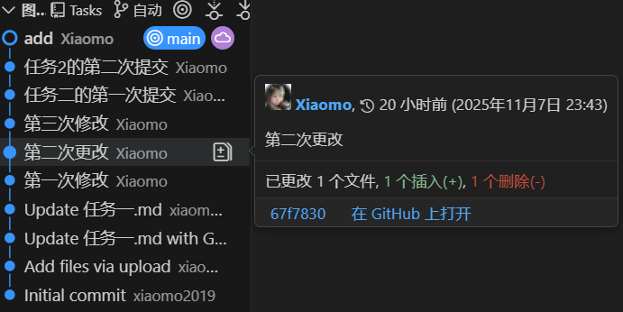
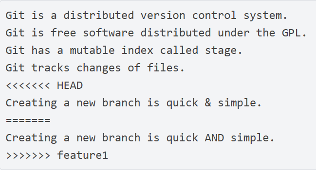

### 在bash或终端
- **git reset --hard commit_id**可以回退到之前某一个已经提交了的版本
### 在VSCode
- 源代码管理器中可以查看
可见图中包含每一次的修改，可随时查看或回档，右侧也会显示出每次的commit id
**冲突的解决**
- 不同分支合并时会产生冲突在VSCode中产生冲突时会有类似页面，只需对其进行最终版修改再进行暂时提交，最后上传到远程仓库就可以了.